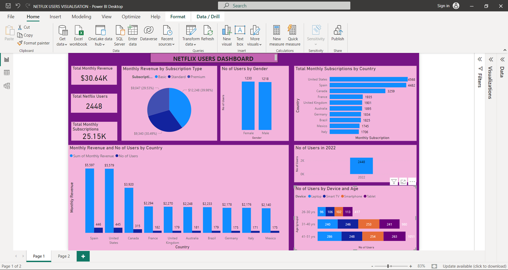

# Netflix Userbase

---
## Introduction

This is a Power Bi project on user analysis for Netflix in 2022. 
This project is done to critically analyze Netflix’s customer base, generate insights, and make decisions from the analysis.

## Problem Statement
1. Which country generated the highest revenue and had the highest number of users?
2. Which subscription type generated the highest revenue?
3. Which age group subscribed the most?
4. Which country had the highest number of monthly subscriptions?

## Skills Demonstrated
The following Power Bi features were used:
- DAX
- Grouping
- Modelling
- Filters
- Sorting
- Creating Date table
- New Measures and Columns

## Modelling

The model is a star schema with one dimension table and one facts table. 
It shows the relationship between the Netflix userbase(facts table) and Calendar table(dimension table).
It model is a many to one relationship.

## Visualization

It comprises of various charts showing:
1. Montly revenue by subscription type
2. Monthly revenue and number of users by country
3. Total monthly subscription by country
4. Number of users by device and age
5. Total monthly revenue, total netflix users and total monthly subscriptions

 ## Analysis
In 2022, Netflix generated a revenue of $30,635
The total number of users is 2448.
The total monthly subscriptions is 25,150.

The country that generated the hightest revenue is Spain with a revenue of $5,597 followed by Unitesd State and Canada.
Also, Spain has the highest number of users. Though Spain has the highest number of users, it did not generate the highest total monthly subscriptions.
United states had the highest monthly susbcriptions while Italy generated the least.

The subscription type that accounted for the highest revenue of $12,248 is Basic type.It accounts for almost 40% of the total revenue.
The standard type generated the least revenue.

The age group of users that subscribe to Netflix the most are people aged between 41-51 years while people between 26-30years subscribe the least.
The devices used the most to access Netflix is laptops.

## Recommendation
I will recommend that more ads about the benefits of the Premium package are targeted to users who subscribe to the Basic package . 
